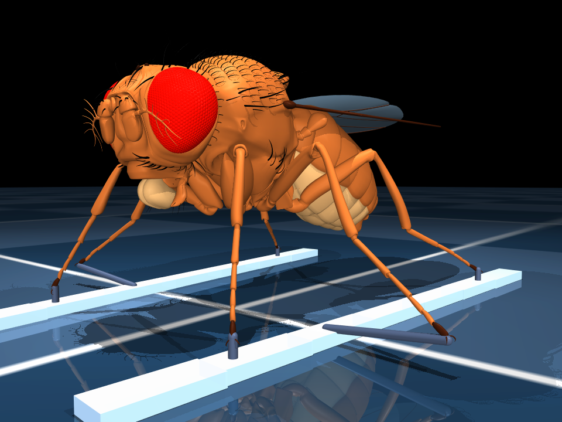

# flykski — 초파리 스키 시뮬레이터

초파리 male CNS 커넥톰([natverse/malecns](https://github.com/natverse/malecns), male-cns:v1.0)과
[flybody](https://github.com/TuragaLab/flybody)(MuJoCo 초파리 전신 모델)를 결합해,
**진짜 신경 배선이 스키 타는 초파리를 제어할 수 있는가**를 실험하는 연구 프로젝트.



## 현재 상태 (2026-09-23)

| 영역 | 상태 |
|---|---|
| 업무1 지형 | 경사+모글/알파인, max_slope 자동보정, 설질 5종 구간, 순차 점화 냄새 게이트. 무한 스트리밍은 미착수 |
| 업무2/3 스키 | **좌/우 휘는 플레이트(N=2)**: 7조각 체인, 굽힘/비틀림 스프링, 캠버/로커, 사이드컷, T1/T3 soft connect + T2 스프링 바인딩. 20° 사면에서 스키만 접지한 채 활강 확인. 텔레메트리(엣지각/하중배분/압력중심/전복) |
| 업무4 커넥톰 | DNg100/DNb08 → 인터뉴런 → 다리 운동뉴런 360개 추출(좌우 포함), LIF 컨트롤러가 리듬 생성, flybody 관절 구동 |
| 업무5 학습 | (1+λ) ES로 뉴런 역할군 파라미터 학습. **real vs shuffled vs random 비교는 3번 모두 유의차 없음**(발화율 보정 후에도) — [RESEARCH_NOTES](RESEARCH_NOTES.md) 26/27/29/31번 |

아직 **컨트롤러가 스키를 타는 단계는 아니다** — 스키/지형 물리는 준비됐고, 커넥톰 컨트롤러는 평지에서만 학습됐다.
힘을 뺀(zero action) 초파리는 알파인 사면은 선 채로 활강하지만 모글에선 전복한다.

## 설치 (다른 PC)

```bash
git clone --recursive https://github.com/WKDev/flykski.git
cd flykski
conda env create -f environment.yml      # Python 3.10 + mujoco 3.14 + dm_control 1.0.47
conda activate flybody
pip install -e ./flybody                 # 서브모듈 TuragaLab/flybody @ d015e9b
python setup/verify.py                   # 설치 검사(지형/스키/텔레메트리/항력/커넥톰 통합)
```

`--recursive`를 빼먹었으면 `git submodule update --init`.
헤드리스 Linux 서버에서 렌더링(render_demo)을 쓰려면 `export MUJOCO_GL=egl`.

커넥톰을 **다시 추출**할 때만 R 환경이 필요하다(추출된 CSV는 `flyski_sim/connectome/`에 포함):
`conda env create -f setup/malecns_environment.yml` → `Rscript setup/install_malecns.R`,
`.env.example`을 `.env`로 복사해 neuprint 토큰 입력. 자세한 삽질 기록은 [ENVIRONMENT.md](ENVIRONMENT.md).

## 실행

모두 레포 루트에서 `python -m`으로 실행한다(`conda activate flybody` 후).
Windows에서 conda 활성화 없이 쓰려면 레포 루트의 `flyski.cmd`로 모듈 이름만 주면 된다
(`%USERPROFILE%\miniforge3\envslybody\python.exe`를 씀). 예: `.lyski play --stage speed --controller snowplow`.

```bash
python -m flyski_sim.live_view                          # 실시간 3D 창 (모글, 힘 뺀 활강)
python -m flyski_sim.live_view --terrain alpine --slowmo 5
python -m flyski_sim.live_view --controller connectome  # LIF 커넥톰 리듬으로 다리 구동
python -m flyski_sim.render_demo                        # renders/ 에 PNG/GIF 저장(오프스크린)

python -m flyski_sim.ski_test                           # 스키 물리(접지/바인딩/휨/활강)
python -m flyski_sim.carving_test --gif                 # 카빙 물리(엣지 방향=회전 방향, skid) + renders/carving/
python -m flyski_sim.render_stance                      # 스키 스탠스 근접 샷(renders/stance/)

# 강화학습(추가 설치: setup/rl_requirements.txt 참고)
python -m flyski_sim.rl_task [course|speed]            # RL 환경 점검(0/무작위 액션 보상 항목)
python -m flyski_sim.play --stage speed --controller snowplow   # 플루크 전문가 실시간 창
python -m flyski_sim.play --stage speed --model runs/speed3/model.zip  # 학습된 정책 실시간 창
python -m flyski_sim.train_rl --minutes 40 --envs 10    # PPO 1회, runs/<이름>/에 곡선/GIF
python -m flyski_sim.run_topology_comparison_calibrated # real/shuffled/random 3x5 비교 (~25분)
```

macOS에서 `live_view`는 `mjpython -m flyski_sim.live_view`로 실행해야 한다(mujoco.viewer 제약).

## 다른 PC에서 카빙 학습 이어가기 (2026-09-27 기준)

지금 진행 중인 학습은 25° 사면 경주 단계(`--stage race`)다. 설계와 경과는 RESEARCH_NOTES 48~50번.
레포에 이어 받을 가중치가 들어 있다: `runs/race25g/model_latest.zip`(가장 최근), `model_best.zip`.

```bash
git clone --recursive https://github.com/WKDev/flykski.git && cd flykski
conda env create -f environment.yml && conda activate flybody
pip install -e ./flybody
pip install torch --index-url https://download.pytorch.org/whl/cpu
pip install -r setup/rl_requirements.txt
python setup/verify.py

# 이어서 학습(이름은 새로). 22시간 = 1320분
python -m flyski_sim.train_rl --stage race --slope 25 --init runs/race25g/model_latest.zip \
    --envs 20 --minutes 1320 --lr 3e-4 --target-kl 0.02 --gamma 0.995 --name race25h
```

Windows(conda 활성화 없이): `.\flyski train_rl --stage race --slope 25 --init runs/race25g/model_latest.zip --envs 20 --minutes 1320 --lr 3e-4 --target-kl 0.02 --gamma 0.995 --name race25h`

- `--envs`: 워커 하나가 메모리 ~1GB를 쓴다. **(RAM GB - 8) 이하**로, 코어 수 - 2 이하로. 32GB면 20, 16GB면 8.
  메모리가 모자라면 워커가 오류 없이 죽고 학습 전체가 멈춘다(`BrokenPipeError`, RESEARCH_NOTES 49번).
- 커리큘럼 단계(최대 진행각 상한)는 가중치에 저장되지 않아 15°부터 다시 올라간다. 이미 배운 정책이면 금방 올라간다.
  상한 45°부터 목표 속도 보상이 켜진다(50번).
- 진행: `runs/race25h.log`(`level=`이 커리큘럼 단계), 곡선 `runs/race25h/progress.csv`, PPO 지표 `runs/race25h/sb3/progress.csv`.
  `model_latest.zip`은 10분마다, `model_best.zip`은 최근 50판 평균 최고일 때 저장.
- 보기/평가:
  ```bash
  python -m flyski_sim.play --stage race --model runs/race25h/model_best.zip
  python -m flyski_sim.record --stage race --model runs/race25h/model_best.zip --name race25h --follow --distance 1.5 --elevation -12
  FLYSKI_SLOPE_DEG=25 python -m flyski_sim.carve_eval runs/race25h/model_best.zip   # 카빙 판정(49번 기준)
  ```
  play/record/carve_eval은 `--slope`가 없으니 경사는 환경 변수로(PowerShell: `$env:FLYSKI_SLOPE_DEG=25`). 안 주면 20°.

## 하드웨어: GPU PC가 더 나은가?

**지금 코드 기준으로는 GPU보다 CPU 코어 수가 중요하다.**
- MuJoCo 물리는 CPU 전용이고, LIF 네트워크(392 뉴런)는 numpy 행렬곱이라 GPU 이득이 거의 없다.
- 비교 실험 1회(3조건×5시드)는 약 25분인데 전부 **단일 코어 순차 실행**이다. ES 평가를 `multiprocessing`으로
  병렬화하면 16코어에서 대략 10배 빨라진다 — 가장 큰 개선 여지(아직 미구현).
- GPU가 의미 있어지는 시점: (a) MJX(MuJoCo-JAX)로 수천 개 환경을 GPU에서 배치 시뮬레이션할 때
  (단, hfield·다접촉·equality 구속 성능/지원 확인 필요), (b) flybody의 PPO/모방학습(TensorFlow) 같은
  신경망 RL 학습, (c) 고해상도 렌더링.

## 구조

```
flyski_sim/
  terrain.py, snow.py, odor.py      업무1: 경사/모글 hfield, 설질, 냄새 게이트
  ski_profiles.py                   업무2: 스키 프로파일 5종
  ski_plate.py                      업무2/3: 좌/우 휘는 플레이트(N=2, 기본)
  ski_attachment.py                 업무2/3: 다리당 미니스키(N=6, 레거시 ski_layout='per_leg')
  tasks.py                          SlopeSmokeTask (스폰 보정, 설질 마찰/항력 런타임 적용)
  telemetry.py                      엣지각/하중배분/압력중심/전복 판정
  connectome/                       R 추출 스크립트 + 추출된 CSV(male-cns:v1.0)
  connectome_controller*.py         rate-model / LIF 컨트롤러
  motor_decoder.py                  운동뉴런 → flybody 액추에이터(좌우 구분)
  train_connectome_params*.py       ES 학습 루프(전역 스칼라 / 역할군 + 발화율 보정)
  run_topology_comparison*.py       real/shuffled/random 다중 시드 비교
  live_view.py, render_demo.py      실시간 창 / 오프스크린 렌더
prompts/                            업무별 설계 문서(00 마스터 ~ 05 학습/평가)
RESEARCH_NOTES.md                   삽질·버그·음성 결과 전체 기록 (작업 전 필독)
ENVIRONMENT.md                      환경 세팅 상세와 알려진 이슈
```

## 데이터/라이선스 메모

- `flybody/`는 TuragaLab/flybody(Apache-2.0) git 서브모듈이다.
- `flyski_sim/connectome/*.csv`는 Janelia FlyEM male-cns:v1.0을 neuPrint로 조회한 결과다 — 사용 시 원 데이터셋 인용 필요.
- 이 레포 자체의 라이선스는 아직 정하지 않았다.
